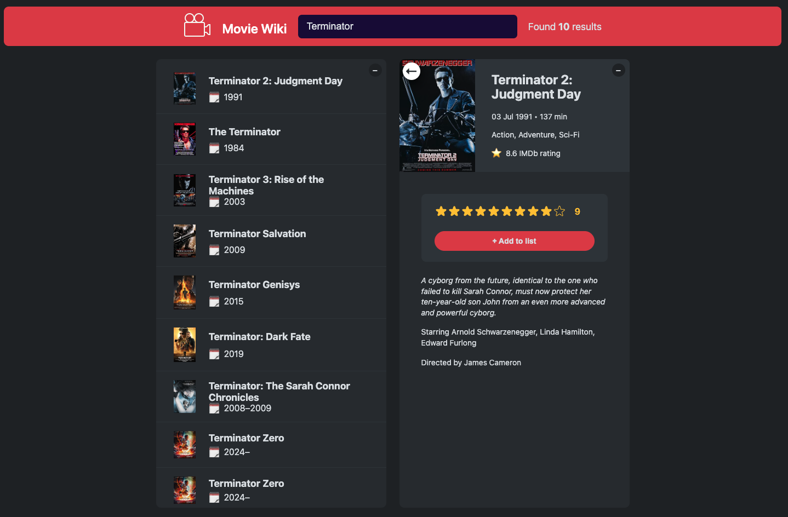

# React + Vite

# Movie Wiki

Movie Wiki is a simple React app for discovering movies and managing your personal watched list. Search for movies, view details, and track the films you've seen—all with a clean and interactive UI.



## Features

- **Movie Search:** Search for movies using the OMDb API.
- **Movie Details:** View details including title, year, poster, IMDb rating, average IMDb ratings from OMDb, and more.
- **Watched List:** Add movies to your watched list, rate them with your own rating, which is automatically saved in localStorage, and keep track of what you've seen.
- **Responsive UI:** Clean, responsive interface built with React and Vite.
- **State Management:** Uses React hooks for state and effects.

## Usage

1. **Install dependencies:**
   ```
   npm install
   ```
2. **Start the development server:**
   ```
   npm run dev
   ```
3. Open your browser and go to [http://localhost:5173](http://localhost:5173).

### Environment Variables

To use the OMDb API, you need to create a `.env` file in the root of the project containing your API key. You can start by copying the provided `.env.example` file:

```
cp .env.example .env
```

Then, replace `your_api_key_here` in the `.env` file with your own OMDb API key. The `.env.example` file contains the following:

```
VITE_API_KEY=your_api_key_here
```

## How it Works

1. **Search for Movies:** Type a movie name into the search bar. Results are fetched from the OMDb API.
2. **View Details:** Click a movie to see its details, average IMDb ratings from OMDb, and ratings.
3. **Add to Watched:** Mark a movie as watched, optionally rate it with your own rating, which is automatically saved in localStorage, and it will appear in your watched list.
4. **Manage Watched List:** See your watched movies, their ratings, including your own saved ratings, and remove any if needed.

## Purpose

This project is intended as a learning resource and demonstration of React fundamentals, including:

- Component composition and props
- State and effect hooks
- Controlled components
- API fetching and async logic
- List rendering and basic CRUD

## Credits

- Uses the [OMDb API](https://www.omdbapi.com/) for movie data.
- Bootstrapped with [Vite](https://vitejs.dev/) and React.

---

Feel free to explore, modify, and extend the app!
